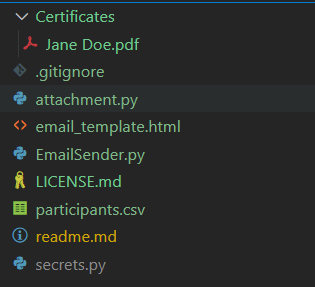

# MLSA-Automated-Emailer [![License: MIT][License-Badge]](LICENSE.md) [![Made with Python][Python-Badge]](https://www.python.org/) 

This is a python based automated emailer that sends emails to the participants of MLSA events. It uses `smtplib` to send emails with a csv file containing the name,email addresses of the participants.

## How to use

### Clone the repository

    ```bash
    git clone https://github.com/Polymath-Saksh/MLSA-Automated-Emailer.git
    ```

### Follow the steps below to use the script

1. Generate your certificates:

    - Manually create your certificates for all participants.  You can also use [Sarita-021's Certificate Generator](https://github.com/Sarita-021/MLSA-Certificate-Generator) to generate certificates automatically.

    - Make sure the certificates are in PDF format and named in the format `Name.pdf`. For example, if the name of the participant is John Doe, the certificate should be named `John Doe.pdf`.

    - Save all the certificates in a folder named [Certificates](Certificates) in the root directory of the project.

2. Create a CSV file with the name and email addresses of the participants:

    - Edit the CSV file in the format as shown in the [participants.csv](participants.csv) file.
    Example:

        ```csv
        Name,Email
        John Doe, john@gmail.com
        Jane Doe, jane@outlook.com
        ```

3. Edit the email content **(Optional)**:

    - You can edit the email content in the [email_template.html](email_template.html) file.

    - Do not remove the receiver_name, event_name and event_date placeholders in the email content, as they will be replaced with the actual values during runtime.

4. Add your event details:

    - Edit the [EmailSender.py](EmailSender.py) file and add your event details on line 18-20. Example:

        ```python
        self.event_name = "Azure Fundamentals Workshop"
        self.event_date = "1st May 2024"
        self.email_subject = "Azure Fundamentals Workshop Completion Certificate"
        ```

5. Last Step! Setup Email Configuration:

    - Create a file named `secrets.py` in the root directory of the project. Add the below code with your credentials:

        ```python
        class Secrets:
            def __init__(self):
                self.email = "myemail@studentambassadors.com"
                self.pwd = "Password1234"

            def get_email(self):
                return self.email

            def get_pwd(self):
                return self.pwd
        ```

6. Run the script:

    - **Do test runs by sending it to your email before sending the emails to all the participants. Author is not responsible for any misuse or error of the script. Contributors are advised to use the script responsibly.**

    - Confirm the directory structure as shown below(`.gitignore` can be ignored):

    


    - Run the [EmailSender.py](EmailSender.py) file:

        ```bash
        python EmailSender.py
        ```

    - The script will send emails to all the participants with their certificates attached. Appropriate success and error messages will be displayed on the console.

## Contributing

Contributions are welcome! Please refer to the [contributing guidelines](CONTRIBUTING.md) for detailed information. 

## License

This project is licensed under the MIT License - see the [LICENSE](LICENSE) file for details.

## Acknowledgements

- [Sarita-021](https://github.com/Sarita-021) for the Certificate Generator.

[License-Badge]:        https://img.shields.io/badge/License-MIT-blue.svg

[Python-Badge]: https://img.shields.io/badge/Python-FFFFFF?logo=python&logoColor=000
